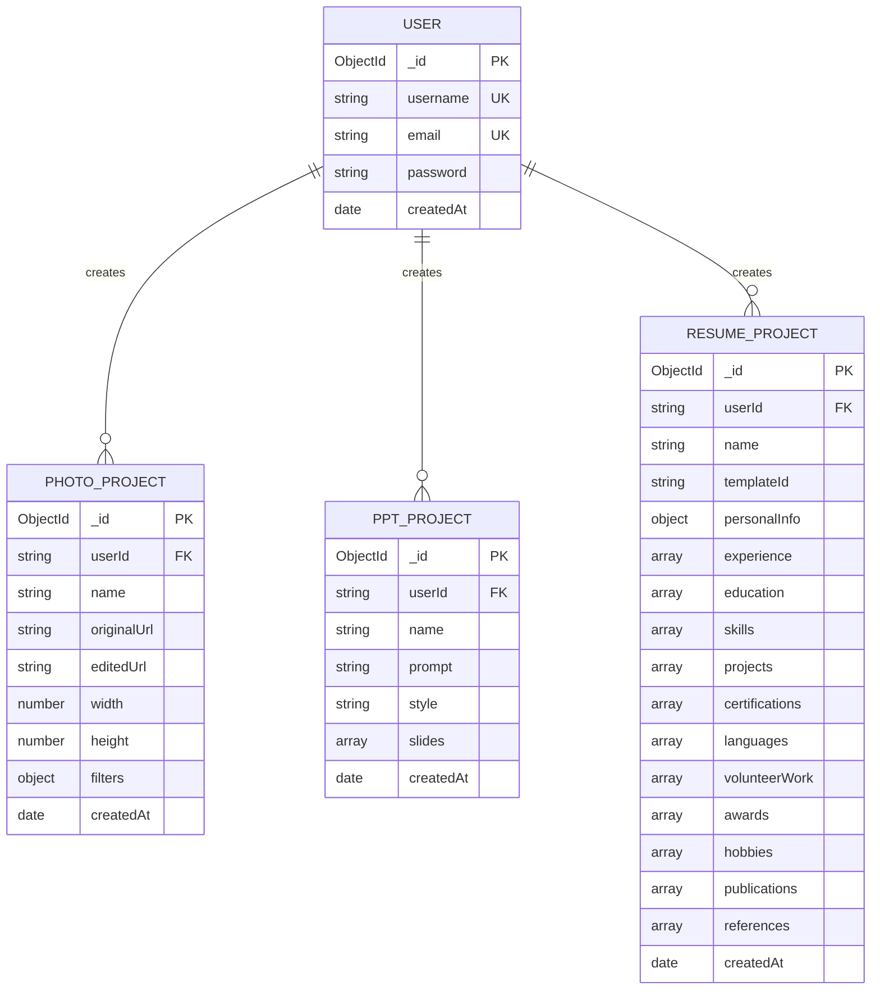
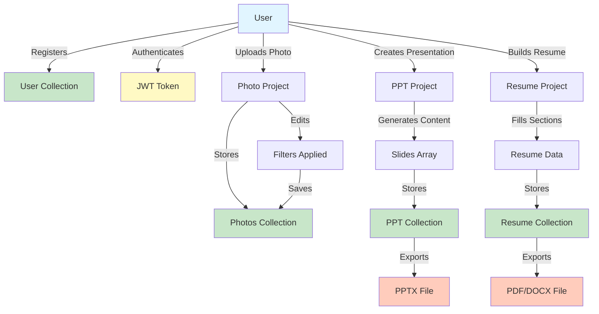

# Entity Relationship Diagram (ERD)
## AI Multi-Tool Web Application

**Version:** 1.0.0  
**Date:** 2026-08-29

---

## 1. Database Schema Diagram



---

## 2. Detailed Entity Specifications

### Entity: USER

**Purpose:** Store user account information and authentication credentials

| Column | Type | Constraints | Description |
|--------|------|-----------|-------------|
| `_id` | ObjectId | PRIMARY KEY, Auto-generated | Unique identifier for each user |
| `username` | String | Required, Trimmed | User's display name |
| `email` | String | Required, Unique, Lowercase, Trimmed | User's email address for login |
| `password` | String | Required, Hashed (bcryptjs) | Encrypted password |
| `createdAt` | Date | Default: now() | Account creation timestamp |

**Relationships:**
- One-to-Many with PHOTO_PROJECT (One user has many photo projects)
- One-to-Many with PPT_PROJECT (One user has many presentations)
- One-to-Many with RESUME_PROJECT (One user has many resumes)

**Indexes:**
- `email` (Unique Index) - Fast lookup by email
- `_id` (Default Primary Index)

**Example Document:**
```json
{
  "_id": ObjectId("507f1f77bcf86cd799439011"),
  "username": "john_doe",
  "email": "john@example.com",
  "password": "$2a$10$N9qo8uLOickgx2ZMRZoMyeIjZAgcg7b3XeKeUxWdeS...",
  "createdAt": "2024-01-15T10:30:00Z"
}
```

---

### Entity: PHOTO_PROJECT

**Purpose:** Store user's photo editing projects and their edited versions

| Column | Type | Constraints | Description |
|--------|------|-----------|-------------|
| `_id` | ObjectId | PRIMARY KEY, Auto-generated | Unique project identifier |
| `userId` | String | Required, Foreign Key | Reference to USER._id |
| `name` | String | Required | Project name/title |
| `originalUrl` | String | Required | URL/path to original image |
| `editedUrl` | String | Optional | URL/path to edited image |
| `width` | Number | Optional | Image width in pixels |
| `height` | Number | Optional | Image height in pixels |
| `filters` | Object | Default: {} | Applied filters metadata |
| `createdAt` | Date | Default: now() | Project creation timestamp |

**Filter Object Structure:**
```json
{
  "brightness": 1.2,
  "contrast": 1.1,
  "saturation": 0.9,
  "hue": 15,
  "blur": 0,
  "grayscale": 0,
  "sepia": 0
}
```

**Indexes:**
- `userId, createdAt` (Compound Index) - Fast retrieval of user's projects sorted by date
- `_id` (Primary Index)

**Example Document:**
```json
{
  "_id": ObjectId("507f1f77bcf86cd799439012"),
  "userId": "507f1f77bcf86cd799439011",
  "name": "Summer Vacation Photo",
  "originalUrl": "/uploads/photo_1234567890.jpg",
  "editedUrl": "/uploads/photo_1234567890_edited.jpg",
  "width": 1920,
  "height": 1080,
  "filters": {
    "brightness": 1.1,
    "contrast": 1.2,
    "saturation": 1.15
  },
  "createdAt": "2024-01-20T14:45:00Z"
}
```

---

### Entity: PPT_PROJECT

**Purpose:** Store PowerPoint presentation projects with slide content

| Column | Type | Constraints | Description |
|--------|------|-----------|-------------|
| `_id` | ObjectId | PRIMARY KEY, Auto-generated | Unique project identifier |
| `userId` | String | Required, Foreign Key | Reference to USER._id |
| `name` | String | Required | Presentation title |
| `prompt` | String | Required | Topic/theme for content generation |
| `style` | String | Required | Presentation style/theme name |
| `slides` | Array | Required | Array of slide objects |
| `createdAt` | Date | Default: now() | Project creation timestamp |

**Slide Object Structure:**
```json
{
  "slideNumber": 1,
  "title": "Slide Title",
  "content": "Slide content text",
  "layout": "title-content",
  "design": {
    "bgColor": "#FFFFFF",
    "textColor": "#000000",
    "accentColor": "#2563EB"
  },
  "elements": [
    {
      "type": "text",
      "content": "Bullet point",
      "x": 50,
      "y": 100
    }
  ]
}
```

**Indexes:**
- `userId, createdAt` (Compound Index) - User's presentations by date
- `_id` (Primary Index)

**Example Document:**
```json
{
  "_id": ObjectId("507f1f77bcf86cd799439013"),
  "userId": "507f1f77bcf86cd799439011",
  "name": "Q1 2024 Sales Report",
  "prompt": "Create a professional sales report presentation",
  "style": "corporate-blue",
  "slides": [
    {
      "slideNumber": 1,
      "title": "Q1 2024 Sales Report",
      "content": "Annual Performance Overview",
      "layout": "title-slide"
    },
    {
      "slideNumber": 2,
      "title": "Revenue Summary",
      "content": "Total Revenue: $2.5M",
      "layout": "title-content"
    }
  ],
  "createdAt": "2024-02-01T09:15:00Z"
}
```

---

### Entity: RESUME_PROJECT

**Purpose:** Store resume projects with comprehensive job seeker information

| Column | Type | Constraints | Description |
|--------|------|-----------|-------------|
| `_id` | ObjectId | PRIMARY KEY, Auto-generated | Unique project identifier |
| `userId` | String | Required, Foreign Key | Reference to USER._id |
| `name` | String | Required | Resume project name/version |
| `templateId` | String | Default: 'modern' | Resume template selection |
| `personalInfo` | Object | Default: {} | Contact and personal details |
| `experience` | Array | Default: [] | Work experience entries |
| `education` | Array | Default: [] | Educational background |
| `skills` | Array | Default: [] | Professional skills |
| `projects` | Array | Default: [] | Portfolio projects |
| `certifications` | Array | Default: [] | Professional certifications |
| `languages` | Array | Default: [] | Language proficiencies |
| `volunteerWork` | Array | Default: [] | Volunteer experience |
| `awards` | Array | Default: [] | Awards and recognitions |
| `hobbies` | Array | Default: [] | Personal interests |
| `publications` | Array | Default: [] | Academic/professional publications |
| `references` | Array | Default: [] | Professional references |
| `createdAt` | Date | Default: now() | Project creation timestamp |

**Nested Object Structures:**

**PersonalInfo Object:**
```json
{
  "fullName": "John Doe",
  "email": "john@example.com",
  "phone": "+1-555-0123",
  "location": "San Francisco, CA",
  "website": "johndoe.com",
  "linkedin": "linkedin.com/in/johndoe",
  "summary": "Experienced software engineer..."
}
```

**Experience Array Item:**
```json
{
  "company": "Tech Corp",
  "position": "Senior Software Engineer",
  "startDate": "2020-01",
  "endDate": "2024-01",
  "currentlyWorking": false,
  "description": "Led development of cloud infrastructure",
  "achievements": ["Achievement 1", "Achievement 2"]
}
```

**Education Array Item:**
```json
{
  "school": "Stanford University",
  "degree": "Bachelor of Science",
  "field": "Computer Science",
  "graduationDate": "2020-05",
  "activities": "Coding club president",
  "gpa": "3.8"
}
```

**Skills Array Item:**
```json
{
  "skillName": "Python",
  "proficiency": "Expert",
  "yearsOfExperience": 5
}
```

**Certifications Array Item:**
```json
{
  "name": "AWS Solutions Architect",
  "issuer": "Amazon Web Services",
  "issueDate": "2023-06",
  "expirationDate": "2025-06",
  "credentialId": "CERT123456",
  "credentialUrl": "https://aws.amazon.com/verify/cert"
}
```

**Indexes:**
- `userId, createdAt` (Compound Index) - User's resumes by date
- `_id` (Primary Index)

**Example Document:**
```json
{
  "_id": ObjectId("507f1f77bcf86cd799439014"),
  "userId": "507f1f77bcf86cd799439011",
  "name": "Software Engineer - 2024",
  "templateId": "modern",
  "personalInfo": {
    "fullName": "John Doe",
    "email": "john@example.com",
    "phone": "+1-555-0123",
    "location": "San Francisco, CA",
    "summary": "Experienced full-stack engineer with 5+ years in cloud development"
  },
  "experience": [
    {
      "company": "Tech Corp",
      "position": "Senior Software Engineer",
      "startDate": "2020-01",
      "endDate": "2024-01",
      "description": "Led development of microservices architecture"
    }
  ],
  "education": [
    {
      "school": "Stanford University",
      "degree": "BS",
      "field": "Computer Science",
      "graduationDate": "2020-05"
    }
  ],
  "skills": [
    {
      "skillName": "Python",
      "proficiency": "Expert"
    }
  ],
  "createdAt": "2024-02-10T11:20:00Z"
}
```

---

## 3. Relationship Definitions

### Relationship 1: USER ↔ PHOTO_PROJECT
- **Type:** One-to-Many (1:N)
- **Cardinality:** User (1) → PhotoProject (*)
- **Foreign Key:** PhotoProject.userId → User._id
- **Relationship Type:** Compositional (projects belong to user)
- **Cascade Behavior:** Delete user → Delete all user's photo projects
- **Query Examples:**
  - Find all photos by user: `db.PHOTO_PROJECT.find({ userId: userId })`
  - Find specific photo: `db.PHOTO_PROJECT.findById(photoId)`

### Relationship 2: USER ↔ PPT_PROJECT
- **Type:** One-to-Many (1:N)
- **Cardinality:** User (1) → PPTProject (*)
- **Foreign Key:** PPTProject.userId → User._id
- **Relationship Type:** Compositional (presentations belong to user)
- **Cascade Behavior:** Delete user → Delete all user's presentations
- **Query Examples:**
  - Find all presentations by user: `db.PPT_PROJECT.find({ userId: userId })`
  - List presentations sorted by date: `db.PPT_PROJECT.find({ userId }).sort({ createdAt: -1 })`

### Relationship 3: USER ↔ RESUME_PROJECT
- **Type:** One-to-Many (1:N)
- **Cardinality:** User (1) → ResumeProject (*)
- **Foreign Key:** ResumeProject.userId → User._id
- **Relationship Type:** Compositional (resumes belong to user)
- **Cascade Behavior:** Delete user → Delete all user's resumes
- **Query Examples:**
  - Find all resumes by user: `db.RESUME_PROJECT.find({ userId: userId })`
  - Find specific resume: `db.RESUME_PROJECT.findById(resumeId)`

---

## 4. Data Flow Diagram



---

## 5. Database Indexing Strategy

### Index 1: User Email Index
```
Collection: USER
Index Name: email_unique
Type: UNIQUE
Fields: { email: 1 }
Purpose: Fast email lookups, prevent duplicate emails
Query Performance: O(log n) - Instant lookups
```

### Index 2: Photo Project User Index
```
Collection: PHOTO_PROJECT
Index Name: userId_createdAt
Type: COMPOUND
Fields: { userId: 1, createdAt: -1 }
Purpose: Retrieve user's photos sorted by date
Query Performance: O(log n) for user retrieval + O(1) sorting
```

### Index 3: PPT Project User Index
```
Collection: PPT_PROJECT
Index Name: userId_createdAt
Type: COMPOUND
Fields: { userId: 1, createdAt: -1 }
Purpose: Retrieve user's presentations sorted by date
Query Performance: O(log n) for user retrieval + O(1) sorting
```

### Index 4: Resume Project User Index
```
Collection: RESUME_PROJECT
Index Name: userId_createdAt
Type: COMPOUND
Fields: { userId: 1, createdAt: -1 }
Purpose: Retrieve user's resumes sorted by date
Query Performance: O(log n) for user retrieval + O(1) sorting
```

---

## 6. Storage Estimates

### Data Volume Projections (1000 users)

| Entity | Avg Size | Total Size | Notes |
|--------|----------|-----------|-------|
| USER (1000 records) | 200 bytes | 200 KB | Profile data |
| PHOTO_PROJECT (50k records) | 1 KB | 50 MB | Metadata only; images stored separately |
| PPT_PROJECT (10k records) | 50 KB | 500 MB | Includes slide content |
| RESUME_PROJECT (5k records) | 100 KB | 500 MB | All resume sections |
| **Total Collections** | - | **1.05 GB** | - |
| Image Storage | 1-5 MB avg | 50-250 GB | Separate blob storage recommended |
| **Total DB** | - | **~1-5 GB** | At scale with image storage |

---

## 7. Data Validation Rules

### USER Collection
- `username`: Non-empty string, 3-50 characters
- `email`: Valid email format, lowercase, unique
- `password`: Minimum 6 characters, hashed before storage
- `createdAt`: Auto-generated ISO date

### PHOTO_PROJECT Collection
- `userId`: Valid ObjectId reference
- `name`: Non-empty string, 1-100 characters
- `originalUrl`: Valid URL or file path
- `filters`: Object with valid numeric values (0-2.0 range)

### PPT_PROJECT Collection
- `userId`: Valid ObjectId reference
- `name`: Non-empty string, 1-100 characters
- `prompt`: Non-empty string
- `style`: Valid style name from predefined list
- `slides`: Non-empty array with valid slide objects

### RESUME_PROJECT Collection
- `userId`: Valid ObjectId reference
- `name`: Non-empty string, 1-100 characters
- `templateId`: Valid template identifier
- `personalInfo`: Object or empty
- All arrays: Array type or empty array

---

## 8. Backup & Recovery Strategy

### Backup Schedule
- **Frequency:** Daily automated backups
- **Retention:** 30-day rolling backup window
- **Location:** MongoDB Atlas automatic backups + AWS S3

### Recovery Time Objectives (RTO)
- Full recovery: 4 hours
- Partial recovery (single collection): 30 minutes
- Point-in-time recovery: Available for last 24 hours

### Data Redundancy
- Multi-region replication (MongoDB Atlas)
- Read replicas in 2+ regions
- Automatic failover enabled

---

## 9. Query Patterns & Performance

### Common Query Patterns

**Pattern 1: Retrieve User's Projects**
```javascript
// Get all photo projects for user, sorted by date
db.PHOTO_PROJECT.find({ userId: userId })
  .sort({ createdAt: -1 })
  .limit(20)
// Index: userId_createdAt
// Expected time: < 10ms
```

**Pattern 2: Get Single Project Details**
```javascript
// Retrieve specific photo with all details
db.PHOTO_PROJECT.findOne({ _id: ObjectId(projectId) })
// Index: _id (default)
// Expected time: < 5ms
```

**Pattern 3: Find User by Email**
```javascript
// User login lookup
db.USER.findOne({ email: userEmail })
// Index: email_unique
// Expected time: < 2ms
```

**Pattern 4: Retrieve All Resume Sections**
```javascript
// Get complete resume data
db.RESUME_PROJECT.findOne({ _id: ObjectId(resumeId) })
// Index: _id (default)
// Expected time: < 5ms
```

---

## 10. Schema Evolution & Versioning

### Version Control
- **Current Schema Version:** 1.0
- **Last Updated:** 2026-08-29
- **Change Log:**
  - V1.0 - Initial release with 4 collections

### Future Schema Changes (Versioning Strategy)
- Add `schemaVersion` field to handle migrations
- Implement backward-compatible updates
- Create migration scripts for data structure changes
- Test schema changes in staging before production

### Potential Schema Extensions
- Add `deletedAt` for soft deletes (PHOTO_PROJECT, PPT_PROJECT, RESUME_PROJECT)
- Add `views` counter (PHOTO_PROJECT, PPT_PROJECT, RESUME_PROJECT)
- Add `tags` array for organization (All project types)
- Add `shared` array for collaboration (All project types)
- Add `ratings` for community features (All project types)

---

## 11. Security & Compliance

### Data Protection
- **Encryption at Rest:** MongoDB Enterprise encryption
- **Encryption in Transit:** TLS 1.2+ for all connections
- **Password Security:** bcryptjs hashing (10 salt rounds)
- **Access Control:** Role-based access (User can only access own data)

### GDPR Compliance
- User data deletion: Delete user → Delete all related collections
- Data portability: Export user data in JSON format
- Data minimization: Only collect necessary fields
- Right to be forgotten: Complete account deletion

### Audit Trail
- All modifications logged with timestamp
- User actions tracked (create, update, delete)
- Failed authentication attempts recorded
- Access logs for sensitive data

---

## 12. Glossary of Terms

| Term | Definition |
|------|-----------|
| **Entity** | A collection representing a business object (User, Photo, etc.) |
| **Attribute** | A field within an entity (username, email, etc.) |
| **Primary Key** | Unique identifier for each record (_id) |
| **Foreign Key** | Reference to another entity's primary key (userId) |
| **Index** | Database structure for faster queries |
| **Compound Index** | Index on multiple fields together |
| **Cardinality** | Relationship multiplicity (1:1, 1:N, N:N) |
| **Cascade** | Automatic action on related records when parent changes |
| **Schema** | Structure and rules for data storage |

---

**Document Version:** 1.0.0  
**Last Updated:** 2026-08-29  
**Next Review:** 2026-12-29
